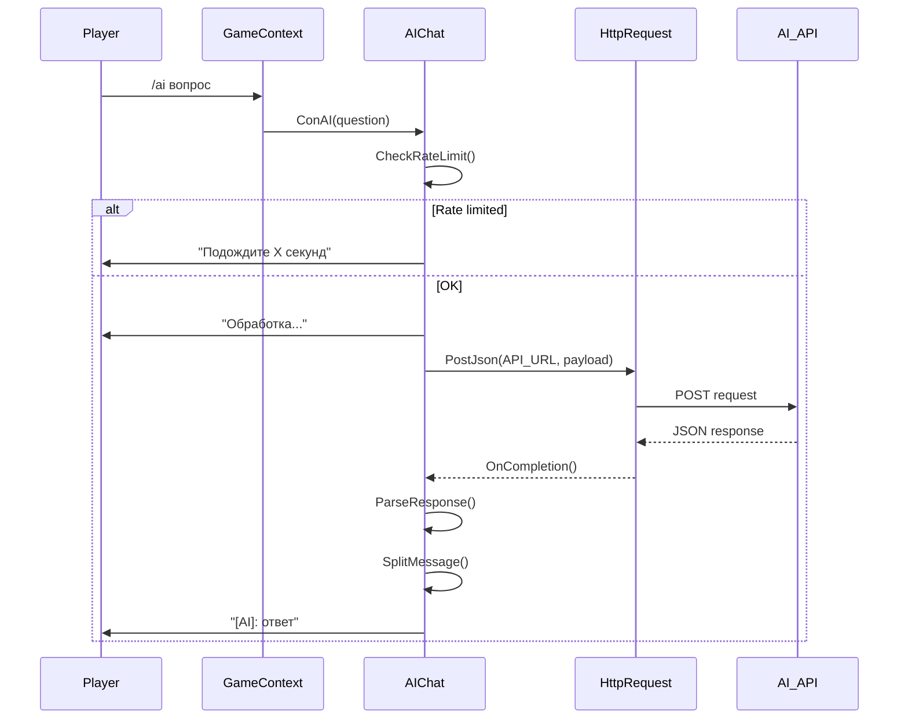

# Design Document: AI Chat Command

## Overview

Данный документ описывает дизайн системы AI чата для DDNet сервера. Система позволяет игрокам отправлять вопросы нейросети через команду `/ai` в игровом чате и получать ответы.

Система использует существующую HTTP инфраструктуру DDNet (CHttpRequest) для асинхронных запросов к внешнему AI API. По умолчанию используется бесплатный API OpenRouter с моделью `meta-llama/llama-3.2-3b-instruct:free`.

## Architecture



## Components and Interfaces

### 1. CAIChat Class

Основной класс для обработки AI запросов.

```cpp
class CAIChat
{
public:
    void Init(CGameContext *pGameServer);
    void ProcessCommand(int ClientId, const char *pQuestion);
    void Tick(); // Проверка завершённых запросов
    
private:
    bool CheckRateLimit(int ClientId);
    void SendRequest(int ClientId, const char *pQuestion);
    void HandleResponse(int ClientId, const char *pResponse);
    void SendChatMessage(int ClientId, const char *pMessage);
    
    // Rate limiting
    int64_t m_aLastRequestTime[MAX_CLIENTS];
    
    // Pending requests
    struct SPendingRequest
    {
        int m_ClientId;
        std::shared_ptr<CHttpRequest> m_pRequest;
    };
    std::vector<SPendingRequest> m_vPendingRequests;
    
    CGameContext *m_pGameServer;
};
```

### 2. Configuration Variables

Новые серверные переменные конфигурации:

| Variable | Type | Default | Description |
|----------|------|---------|-------------|
| `sv_ai_enabled` | int | 1 | Включить/выключить AI чат |
| `sv_ai_api_url` | string | "https://openrouter.ai/api/v1/chat/completions" | URL API |
| `sv_ai_api_key` | string | "" | API ключ (опционально для бесплатных моделей) |
| `sv_ai_cooldown` | int | 10 | Кулдаун между запросами в секундах |
| `sv_ai_max_response` | int | 500 | Максимальная длина ответа в символах |

### 3. Chat Command Registration

Команда регистрируется в `RegisterChatCommands()`:

```cpp
Console()->Register("ai", "r[question]", CFGFLAG_CHAT | CFGFLAG_SERVER, ConAI, this, "Ask AI a question");
```

## Data Models

### Request JSON Format (OpenRouter API)

```json
{
    "model": "meta-llama/llama-3.2-3b-instruct:free",
    "messages": [
        {
            "role": "system",
            "content": "You are a helpful assistant. Keep responses brief and under 200 characters."
        },
        {
            "role": "user", 
            "content": "<question>"
        }
    ],
    "max_tokens": 150
}
```

### Response JSON Format

```json
{
    "choices": [
        {
            "message": {
                "content": "<response>"
            }
        }
    ]
}
```

## Correctness Properties

*A property is a characteristic or behavior that should hold true across all valid executions of a system-essentially, a formal statement about what the system should do. Properties serve as the bridge between human-readable specifications and machine-verifiable correctness guarantees.*

### Property 1: Empty input rejection
*For any* input string that is empty or contains only whitespace characters, the AI_Chat_System should reject the request and return a usage hint message.
**Validates: Requirements 1.2**

### Property 2: Response message splitting
*For any* response string longer than 128 characters, the split function should produce chunks where each chunk is at most 128 characters, and concatenating all chunks produces the original string.
**Validates: Requirements 1.3**

### Property 3: Rate limiting enforcement
*For any* player, if they send an `/ai` request and then immediately send another request within the cooldown period, the second request should be rejected. After the cooldown expires, the next request should be accepted.
**Validates: Requirements 3.2, 3.3**

### Property 4: Response prefix formatting
*For any* AI response, the displayed message should be prefixed with "[AI]: ".
**Validates: Requirements 4.2**

### Property 5: API key header inclusion
*For any* non-empty API key configuration, the HTTP request headers should contain an "Authorization" header with the value "Bearer <api_key>".
**Validates: Requirements 2.4**

## Error Handling

| Error Condition | User Message | Log Level |
|-----------------|--------------|-----------|
| Empty question | "Использование: /ai <вопрос>" | None |
| Rate limited | "Подождите X секунд перед следующим запросом" | None |
| AI disabled | "AI чат отключён на этом сервере" | None |
| HTTP timeout | "Ошибка: превышено время ожидания" | Warning |
| HTTP error | "Ошибка: не удалось получить ответ" | Warning |
| JSON parse error | "Ошибка: неверный формат ответа" | Error |
| Response too long | Truncate + "..." | None |

## Testing Strategy

### Property-Based Testing

Используем Google Test с ручной генерацией тестовых данных для проверки свойств:

1. **Response splitting property**: Генерируем строки разной длины и проверяем корректность разбиения
2. **Rate limiting property**: Симулируем последовательные запросы и проверяем соблюдение кулдауна
3. **Input validation property**: Генерируем различные пустые/whitespace строки

### Unit Tests

1. JSON request construction
2. JSON response parsing
3. Configuration variable handling
4. Message formatting

### Integration Tests

1. Full command flow with mocked HTTP
2. Error handling scenarios
