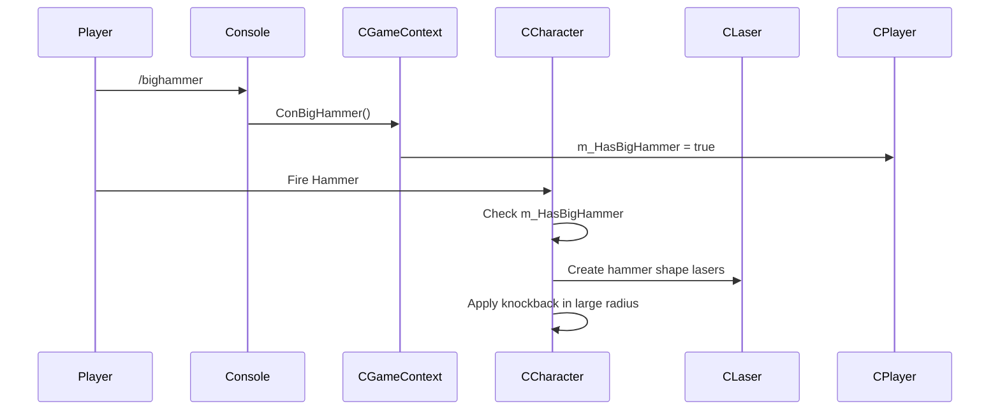

# Design Document: BigHammer

## Overview

BigHammer добавляет команду `/bighammer`, которая даёт игроку огромный лазерный молоток. При ударе создаётся визуальный эффект из множества лазерных лучей в форме молотка, который отталкивает всех игроков в большом радиусе.

## Architecture

Реализация использует существующую архитектуру DDNet:
- Флаг `m_HasBigHammer` в классе `CPlayer` для отслеживания состояния
- Модификация `FireWeapon()` в `CCharacter` для создания лазерного эффекта
- Использование существующего класса `CLaser` для визуализации



## Components and Interfaces

### CPlayer (player.h)
```cpp
// New member variable
bool m_HasBigHammer;
```

### CGameContext (gamecontext.h)
```cpp
// New console command handlers
static void ConBigHammer(IConsole::IResult *pResult, void *pUserData);
static void ConUnBigHammer(IConsole::IResult *pResult, void *pUserData);
```

### CCharacter (character.cpp)
Модификация в `FireWeapon()` case `WEAPON_HAMMER`:
- Проверка `m_pPlayer->m_HasBigHammer`
- Создание лазеров в форме молотка
- Расширенный радиус поражения

## Data Models

### BigHammer Parameters
```cpp
const float BIGHAMMER_RADIUS = 200.0f;      // Радиус поражения (5x обычного)
const float BIGHAMMER_LASER_LENGTH = 150.0f; // Длина лазерных лучей
const int BIGHAMMER_LASER_COUNT = 8;         // Количество лазеров в эффекте
const int BIGHAMMER_LIFETIME_MS = 500;       // Время жизни эффекта
```

## Correctness Properties

*A property is a characteristic or behavior that should hold true across all valid executions of a system-essentially, a formal statement about what the system should do. Properties serve as the bridge between human-readable specifications and machine-verifiable correctness guarantees.*

### Property 1: BigHammer toggle on
*For any* player, after executing the bighammer command, the player's BigHammer flag should be true.
**Validates: Requirements 1.1**

### Property 2: BigHammer toggle off
*For any* player with BigHammer enabled, after executing the unbighammer command, the player's BigHammer flag should be false.
**Validates: Requirements 1.3**

### Property 3: Laser creation on fire
*For any* player with BigHammer enabled, firing the hammer weapon should create multiple laser entities.
**Validates: Requirements 2.1**

### Property 4: Knockback radius
*For any* player within BIGHAMMER_RADIUS of a BigHammer strike, that player should receive knockback.
**Validates: Requirements 3.1**

### Property 5: Unfreeze on hit
*For any* frozen player within BIGHAMMER_RADIUS of a BigHammer strike, that player should become unfrozen.
**Validates: Requirements 3.2**

## Error Handling

- Если игрок не жив при вызове команды - показать сообщение об ошибке
- Если BigHammer уже включен - команда не делает ничего
- Если игрок заморожен - BigHammer не срабатывает (стандартное поведение)

## Testing Strategy

### Unit Tests
- Тест включения/выключения флага BigHammer
- Тест создания лазеров при ударе

### Property-Based Tests
Используем существующий тестовый фреймворк DDNet для проверки:
- Корректность переключения состояния
- Радиус поражения соответствует спецификации
- Все игроки в радиусе получают knockback
