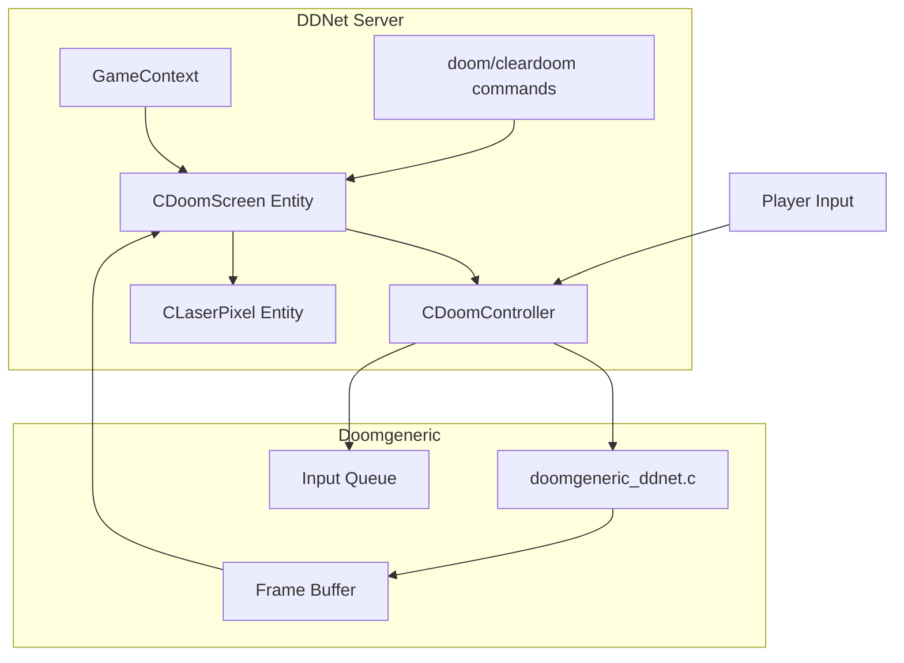

# Design Document: DOOM Laser Display

## Overview

Интеграция игры Doomgeneric в DDNet сервер. Игрок вводит команду `doom` - рядом с ним появляется экран с игрой DOOM, отрисованный сеткой разноцветных лазеров. Персонаж замораживается, управление перенаправляется в DOOM. Команда `cleardoom` убирает экран и возвращает управление. Все игроки на сервере видят геймплей в реальном времени.

## Architecture



### Архитектурные решения

1. **Doomgeneric как встроенная библиотека**: Doomgeneric компилируется как часть сервера с кастомным бэкендом `doomgeneric_ddnet.c`
2. **Один экземпляр DOOM на игрока**: Каждый CDoomScreen содержит свой экземпляр DOOM
3. **Лазерная сетка**: Экран состоит из множества CLaserPixel сущностей, каждая представляет один пиксель
4. **Цветовая палитра**: DOOM палитра (256 цветов) маппится на 7 типов лазеров DDNet

## Components and Interfaces

### CDoomScreen (Entity)

Основная сущность экрана DOOM на карте.

```cpp
class CDoomScreen : public CEntity
{
public:
    CDoomScreen(CGameWorld *pGameWorld, vec2 Pos, int ClientId);
    ~CDoomScreen();
    
    void Reset() override;
    void Tick() override;
    void Snap(int SnappingClient) override;
    
    // Управление
    void ProcessInput(const CNetObj_PlayerInput *pInput);
    void UpdateFrame();
    
    int GetOwner() const { return m_OwnerId; }

private:
    int m_Width;           // Ширина в пикселях (64)
    int m_Height;          // Высота в пикселях (48)
    float m_Scale;         // Масштаб (расстояние между лазерами)
    int m_OwnerId;         // ID игрока-владельца
    
    CDoomController *m_pController;
    std::vector<CLaserPixel*> m_aPixels;
    
    // Буфер предыдущего кадра для delta-обновлений
    std::vector<int> m_aPrevFrame;
};
```

### CDoomController

Управляет экземпляром Doomgeneric и обрабатывает ввод.

```cpp
class CDoomController
{
public:
    CDoomController();
    ~CDoomController();
    
    bool Init(const char *pWadPath);
    void Shutdown();
    
    // Обработка ввода DDNet -> DOOM
    void ProcessInput(const CNetObj_PlayerInput *pInput);
    
    // Получение кадра
    void Tick();
    const uint32_t *GetFrameBuffer() const;
    int GetFrameWidth() const { return DOOMGENERIC_RESX; }
    int GetFrameHeight() const { return DOOMGENERIC_RESY; }
    
    bool IsRunning() const { return m_Running; }

private:
    bool m_Running;
    int m_LastKeys;  // Предыдущее состояние клавиш для edge detection
    
    // Маппинг DDNet input -> DOOM keys
    static int TranslateInput(const CNetObj_PlayerInput *pInput);
};
```

### CLaserPixel (Entity)

Один пиксель экрана, представленный лазером.

```cpp
class CLaserPixel : public CEntity
{
public:
    CLaserPixel(CGameWorld *pGameWorld, vec2 Pos, int LaserType);
    
    void Snap(int SnappingClient) override;
    
    void SetColor(int LaserType);
    int GetColor() const { return m_LaserType; }

private:
    int m_LaserType;  // LASERTYPE_RIFLE, LASERTYPE_SHOTGUN, etc.
    int m_StartTick;
};
```

### Интерфейс Doomgeneric

```c
// doomgeneric_ddnet.c - кастомный бэкенд для DDNet

void DG_Init();
void DG_DrawFrame();
void DG_SleepMs(uint32_t ms);
uint32_t DG_GetTicksMs();
int DG_GetKey(int *pressed, unsigned char *key);
void DG_SetWindowTitle(const char *title);

// DDNet-специфичные функции
void DG_SetInputCallback(void (*callback)(int keys));
const uint32_t *DG_GetFrameBuffer();
```

## Data Models

### Цветовая палитра

DOOM использует 256-цветную палитру. Маппинг на типы лазеров DDNet:

| DOOM Color Range | Laser Type | Visual Color |
|-----------------|------------|--------------|
| Красные (r > 180) | LASERTYPE_RIFLE | Красный |
| Жёлтые (r > 180, g > 150) | LASERTYPE_SHOTGUN | Жёлтый |
| Зелёные (g > 150) | LASERTYPE_FREEZE | Голубой |
| Синие (b > 150) | LASERTYPE_DOOR | Синий |
| Коричневые (r > 100, g > 50) | LASERTYPE_DRAGGER | Фиолетовый |
| Тёмные (r,g,b < 80) | LASERTYPE_GUN | Серый |
| Остальные | LASERTYPE_PLASMA | Оранжевый |

```cpp
int MapDoomColorToLaser(uint32_t argb)
{
    int r = (argb >> 16) & 0xFF;
    int g = (argb >> 8) & 0xFF;
    int b = argb & 0xFF;
    
    if(r > 180 && g < 100 && b < 100) return LASERTYPE_RIFLE;
    if(r > 180 && g > 150 && b < 100) return LASERTYPE_SHOTGUN;
    if(g > 150 && r < 100 && b < 100) return LASERTYPE_FREEZE;
    if(b > 150 && r < 100 && g < 100) return LASERTYPE_DOOR;
    if(r > 100 && g > 50 && b < 50)   return LASERTYPE_DRAGGER;
    if(r < 80 && g < 80 && b < 80)    return LASERTYPE_GUN;
    return LASERTYPE_PLASMA;
}
```

### Маппинг ввода

```cpp
// DDNet Input -> DOOM Keys
// m_Direction < 0    ->    KEY_LEFTARROW (поворот влево)
// m_Direction > 0    ->    KEY_RIGHTARROW (поворот вправо)
// m_Jump             ->    KEY_UPARROW (вперёд)
// m_Hook             ->    KEY_DOWNARROW (назад)
// m_Fire             ->    KEY_FIRE (стрельба)
// m_Hook + m_Jump    ->    KEY_USE (открыть дверь)
```


## Correctness Properties

*A property is a characteristic or behavior that should hold true across all valid executions of a system-essentially, a formal statement about what the system should do. Properties serve as the bridge between human-readable specifications and machine-verifiable correctness guarantees.*

### Property 1: Doom command creates screen with correct owner
*For any* player who executes the doom command, a Doom_Screen entity SHALL be created near the player position with that player set as the owner.
**Validates: Requirements 1.1, 1.2**

### Property 2: Doom/cleardoom round-trip restores player state
*For any* player who executes doom then cleardoom, the player SHALL be unfrozen and the Doom_Screen SHALL be removed.
**Validates: Requirements 1.3, 1.4**

### Property 3: Input mapping consistency
*For any* valid DDNet player input, the DOOM_Controller SHALL produce a deterministic and correct DOOM key state (direction for turning, jump for forward, hook for backward, fire for shooting).
**Validates: Requirements 2.1, 2.2, 2.3, 2.4, 2.5**

### Property 4: Color mapping completeness
*For any* DOOM ARGB color value, the color mapping function SHALL produce a valid DDNet laser type (one of LASERTYPE_RIFLE, LASERTYPE_SHOTGUN, LASERTYPE_DOOR, LASERTYPE_FREEZE, LASERTYPE_DRAGGER, LASERTYPE_GUN, LASERTYPE_PLASMA).
**Validates: Requirements 3.1, 5.1**

### Property 5: Pixel grid dimensions
*For any* configured screen resolution (width W, height H), the Doom_Screen SHALL create exactly W * H laser pixel entities.
**Validates: Requirements 3.2**

### Property 6: Delta update correctness
*For any* two consecutive frames, only pixels whose color changed SHALL be updated in the laser grid.
**Validates: Requirements 3.3**

### Property 7: Frame data round-trip
*For any* valid frame buffer, encoding then decoding the frame data SHALL produce equivalent laser color values.
**Validates: Requirements 5.3, 5.4**

### Property 8: Screen instance isolation
*For any* two Doom_Screen entities, input to one screen SHALL NOT affect the DOOM state of the other screen.
**Validates: Requirements 6.3**

## Error Handling

| Ошибка | Обработка |
|--------|-----------|
| WAD файл не найден | Логирование ошибки, экран не создаётся |
| DOOM_INTEGRATION отключен | Сообщение "DOOM integration is disabled" |
| Игрок уже имеет экран | Сообщение "You already have a DOOM screen" |
| Игрок отключился | Автоматическое удаление экрана |

## Testing Strategy

### Dual Testing Approach

Используем комбинацию unit-тестов и property-based тестов.

### Property-Based Testing

Библиотека: **RapidCheck** (C++ property-based testing library)

Конфигурация: минимум 100 итераций на свойство.

```cpp
// Пример property-based теста
// **Feature: doom-laser-display, Property 4: Color mapping completeness**
RC_GTEST_PROP(DoomColorMapping, AllColorsMapToValidLaser, ())
{
    uint32_t color = *rc::gen::arbitrary<uint32_t>();
    int laserType = MapDoomColorToLaser(color);
    
    RC_ASSERT(laserType >= LASERTYPE_RIFLE);
    RC_ASSERT(laserType <= LASERTYPE_PLASMA);
}
```

### Unit Tests

Unit-тесты для конкретных сценариев:
1. Создание экрана командой doom
2. Удаление экрана командой cleardoom
3. Обработка ввода игрока
