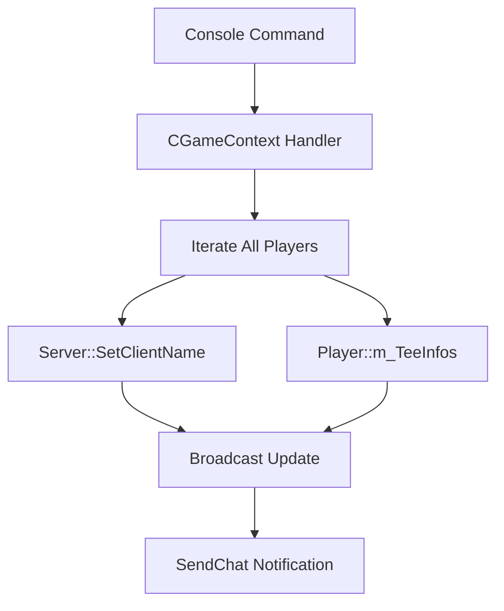

# Design Document: homari0 and 5years Commands

## Overview

Реализация двух серверных консольных команд для DDNet:
- `homari0` - меняет ник всех игроков на "homari0"
- `5years` - меняет ник всех игроков на "5years" и скин на "hedwige"

Команды будут реализованы по аналогии с существующими DDRace командами в `ddracecommands.cpp`.

## Architecture



Команды интегрируются в существующую архитектуру DDNet сервера:
1. Регистрация команд в `CGameContext::RegisterDDRaceCommands()`
2. Обработчики команд в `ddracecommands.cpp`
3. Использование существующих API для изменения ника и скина

## Components and Interfaces

### New Functions in CGameContext

```cpp
// Handler for homari0 command
static void ConHomari0(IConsole::IResult *pResult, void *pUserData);

// Handler for 5years command  
static void Con5Years(IConsole::IResult *pResult, void *pUserData);
```

### Existing Interfaces Used

- `Server()->SetClientName(ClientId, pName)` - изменение ника игрока
- `m_apPlayers[i]->m_TeeInfos.m_aSkinName` - изменение скина игрока
- `SendChat(-1, TEAM_ALL, message)` - отправка сообщения всем игрокам

## Data Models

### CTeeInfo (existing)
```cpp
class CTeeInfo {
    char m_aSkinName[24];        // Имя скина
    int m_UseCustomColor;         // Использование кастомных цветов
    int m_ColorBody;              // Цвет тела
    int m_ColorFeet;              // Цвет ног
};
```

Для команды `5years` будем менять `m_aSkinName` на "hedwige".

## Correctness Properties

*A property is a characteristic or behavior that should hold true across all valid executions of a system-essentially, a formal statement about what the system should do. Properties serve as the bridge between human-readable specifications and machine-verifiable correctness guarantees.*

### Property Reflection

После анализа требований, свойства 1.1 и 2.1 можно объединить в одно общее свойство о смене ников, а 2.2 остается отдельным свойством о смене скинов.

### Properties

**Property 1: Nickname change applies to all players**
*For any* set of connected players, when the homari0 or 5years command is executed, all players SHALL have their nickname changed to the specified value ("homari0" or "5years" respectively).
**Validates: Requirements 1.1, 2.1**

**Property 2: Skin change applies to all players**
*For any* set of connected players, when the 5years command is executed, all players SHALL have their skin changed to "hedwige".
**Validates: Requirements 2.2**

## Error Handling

- Если нет подключенных игроков, команда выполнится без ошибок (просто ничего не изменится)
- Если игрок отключится во время выполнения команды, он будет пропущен (проверка `m_apPlayers[i] != nullptr`)

## Testing Strategy

### Unit Testing

Данные команды тесно интегрированы с серверной инфраструктурой DDNet. Юнит-тестирование затруднено из-за зависимости от:
- Серверного контекста
- Сетевого стека
- Состояния игроков

Рекомендуется ручное тестирование на локальном сервере.

### Property-Based Testing

Из-за специфики DDNet (C++ игровой сервер без встроенного PBT фреймворка), property-based тестирование не применимо для данной функциональности. Свойства будут проверяться через ручное тестирование и code review.

### Manual Testing Checklist

1. Запустить сервер с несколькими ботами/игроками
2. Выполнить команду `homari0` - проверить что все ники изменились
3. Выполнить команду `5years` - проверить что все ники и скины изменились
4. Проверить что изменения видны всем клиентам
