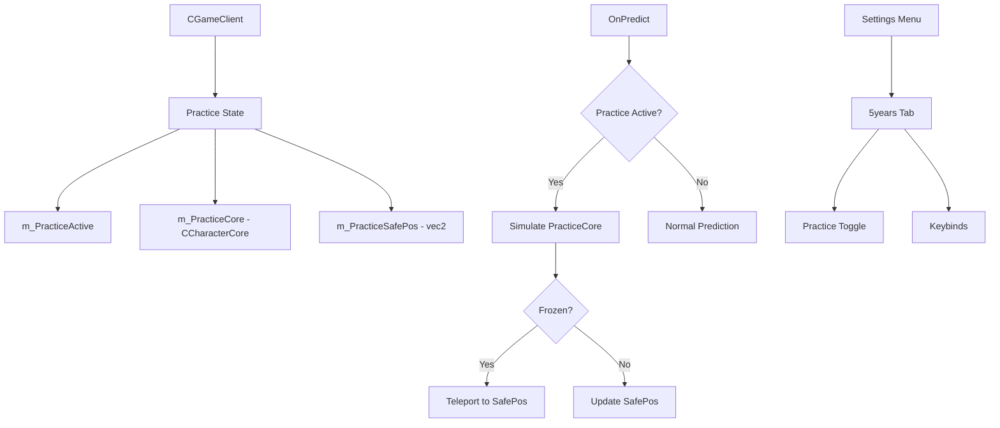

# Design Document: Local Practice System

## Overview

Система локальной тренировки использует существующую архитектуру FakeSuper в DDNet для создания отдельной локальной симуляции персонажа. Когда practice mode активен, сервер продолжает видеть игрока на исходной позиции, в то время как локально симулируется полное движение с автоматическим сбросом при попадании во фриз.

## Architecture



Система интегрируется в существующую архитектуру:
- Использует `CCharacterCore` для физической симуляции (как FakeSuper)
- Добавляет состояние practice в `CGameClient`
- Добавляет вкладку "5years" в меню настроек
- Регистрирует консольные команды

## Components and Interfaces

### Practice State in CGameClient

```cpp
// Practice mode state (добавить в CGameClient)
bool m_PracticeActive;
CCharacterCore m_PracticeCore;
CCharacterCore m_PracticePrevCore;
CWorldCore m_PracticeWorld;
vec2 m_PracticeSafePos;
vec2 m_PracticeSafeVel;
int m_PracticeLastTick;
vec2 m_PracticeStartPos; // Position where practice was enabled
```

### Console Commands

| Command | Description |
|---------|-------------|
| `practice_toggle` | Включить/выключить practice mode |
| `practice_reset` | Телепорт на безопасную позицию |
| `practice_checkpoint` | Установить текущую позицию как checkpoint |

### Config Variables

| Variable | Type | Default | Description |
|----------|------|---------|-------------|
| `cl_practice` | int | 0 | Practice mode enabled |

## Data Models

### Practice State

Состояние practice mode хранится в CGameClient:
- `m_PracticeActive` - флаг активности режима
- `m_PracticeCore` - текущее состояние симулируемого персонажа
- `m_PracticePrevCore` - предыдущее состояние для интерполяции
- `m_PracticeSafePos` - последняя безопасная позиция
- `m_PracticeStartPos` - позиция где был включен practice mode

## Correctness Properties

*A property is a characteristic or behavior that should hold true across all valid executions of a system-essentially, a formal statement about what the system should do. Properties serve as the bridge between human-readable specifications and machine-verifiable correctness guarantees.*

### Property 1: Toggle is involutory
*For any* practice system state, calling Toggle() twice SHALL return the system to its original active/inactive state.
**Validates: Requirements 1.1, 1.2**

### Property 2: Freeze triggers teleport to safe position
*For any* practice session where the character enters a freeze tile, the character position SHALL be set to the last Safe_Position.
**Validates: Requirements 3.1**

### Property 3: Safe position updates when not frozen
*For any* practice session where the character is not frozen, the Safe_Position SHALL be updated to the current position.
**Validates: Requirements 3.2**

### Property 4: Teleport resets velocity
*For any* teleport operation (freeze or manual reset), the character velocity SHALL be set to zero.
**Validates: Requirements 3.3, 4.2**

### Property 5: Checkpoint saves current position
*For any* checkpoint command, the Safe_Position SHALL be set to the current character position.
**Validates: Requirements 5.1**

## Error Handling

| Error Condition | Handling |
|-----------------|----------|
| Practice enabled without local character | Ignore command, show warning |
| No safe position available | Use start position |
| Collision data unavailable | Disable practice mode |

## Testing Strategy

### Dual Testing Approach

1. **Unit Tests**: Проверяют конкретные примеры
2. **Property-Based Tests**: Проверяют универсальные свойства

### Property-Based Testing Library

Используется библиотека **rapidcheck** для C++ property-based testing.

### Test Coverage

- Toggle behavior
- Freeze detection and teleport
- Safe position updates
- Velocity reset on teleport
- Checkpoint functionality

## Implementation Notes

### Integration with FakeSuper

Practice mode использует похожий подход как существующий FakeSuper:
1. Инициализация `m_PracticeCore` из текущего `m_PredictedChar`
2. Симуляция физики в `OnPredict()`
3. Рендеринг через `UpdateRenderedCharacters()`

### Freeze Detection

Проверка фриза через `Collision()->GetTile()` или проверку `m_FreezeEnd` в core.

### Settings Tab

Добавить новую вкладку "5years" в `menus_settings.cpp` с:
- Checkbox для practice mode
- Keybind настройки для команд
