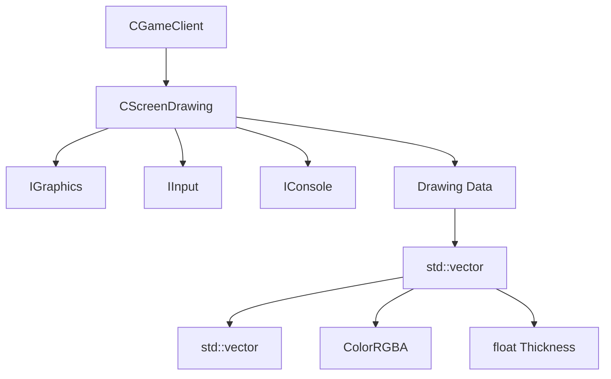

# Design Document: Screen Drawing System

## Overview

Система рисования на экране для клиента DDNet реализуется как новый компонент `CScreenDrawing`, который наследуется от базового класса `CComponent`. Компонент позволяет игрокам рисовать линии на экране с помощью курсора мыши. Рисунки отображаются в screen-space координатах (фиксированы к экрану, не к миру) и сохраняются до явной очистки.

## Architecture



Компонент интегрируется в существующую архитектуру клиента DDNet:
- Регистрируется в `CGameClient` как компонент
- Использует `IGraphics` для рендеринга линий через `LinesBegin()`/`LinesEnd()`
- Использует `IInput` для отслеживания позиции курсора и состояния кнопок
- Регистрирует консольные команды через `IConsole`

## Components and Interfaces

### CScreenDrawing Component

```cpp
class CScreenDrawing : public CComponent
{
public:
    // Component interface
    int Sizeof() const override;
    void OnConsoleInit() override;
    void OnInit() override;
    void OnReset() override;
    void OnRender() override;
    bool OnInput(const IInput::CEvent &Event) override;
    bool OnCursorMove(float x, float y, IInput::ECursorType CursorType) override;
    
    // Drawing API
    void Toggle();
    void Clear();
    void SetColor(ColorRGBA Color);
    void SetThickness(float Thickness);
    
    // Serialization
    void Serialize(char *pBuffer, int BufferSize) const;
    bool Deserialize(const char *pData);
    
    // State queries
    bool IsActive() const;
    int GetLineCount() const;
    int GetTotalPointCount() const;
    ColorRGBA GetCurrentColor() const;
    float GetCurrentThickness() const;
};
```

### Console Commands

| Command | Arguments | Description |
|---------|-----------|-------------|
| `+draw` | - | Включить режим рисования (при удержании) |
| `draw_toggle` | - | Переключить режим рисования |
| `draw_clear` | - | Очистить все рисунки |
| `draw_color` | `r g b [a]` | Установить цвет (0-255) |
| `draw_thickness` | `thickness` | Установить толщину линии |

### Config Variables

| Variable | Type | Default | Description |
|----------|------|---------|-------------|
| `cl_draw_color` | int | 0xFFFFFFFF | Цвет рисования (RGBA) |
| `cl_draw_thickness` | int | 2 | Толщина линии в пикселях |

## Data Models

### CDrawingPoint

```cpp
struct CDrawingPoint
{
    float m_X;      // Screen X coordinate (0.0 - screen width)
    float m_Y;      // Screen Y coordinate (0.0 - screen height)
};
```

### CDrawingLine

```cpp
struct CDrawingLine
{
    std::vector<CDrawingPoint> m_vPoints;  // Points in the line
    ColorRGBA m_Color;                      // Line color
    float m_Thickness;                      // Line thickness in pixels
};
```

### Serialization Format

Формат сериализации для сохранения/загрузки рисунков:

```
DRAW_V1
<line_count>
<color_r> <color_g> <color_b> <color_a> <thickness> <point_count>
<x1> <y1>
<x2> <y2>
...
```

## Correctness Properties

*A property is a characteristic or behavior that should hold true across all valid executions of a system-essentially, a formal statement about what the system should do. Properties serve as the bridge between human-readable specifications and machine-verifiable correctness guarantees.*

### Property 1: Toggle is involutory
*For any* drawing system state, calling Toggle() twice SHALL return the system to its original active/inactive state.
**Validates: Requirements 1.1, 1.2**

### Property 2: Lines persist after mode change
*For any* set of drawing lines, disabling drawing mode SHALL NOT change the number of stored lines.
**Validates: Requirements 1.3, 4.1**

### Property 3: Clear removes all lines
*For any* drawing system with N lines (N >= 0), calling Clear() SHALL result in exactly 0 lines.
**Validates: Requirements 3.1**

### Property 4: Adding points increases count
*For any* active drawing session, adding a point SHALL increase the total point count by exactly 1.
**Validates: Requirements 2.1**

### Property 5: Color setting is applied
*For any* valid color value, calling SetColor() SHALL update GetCurrentColor() to return that value.
**Validates: Requirements 5.2**

### Property 6: Thickness setting is applied
*For any* valid thickness value (> 0), calling SetThickness() SHALL update GetCurrentThickness() to return that value.
**Validates: Requirements 6.2**

### Property 7: Serialization round-trip
*For any* valid drawing data, serializing then deserializing SHALL produce equivalent drawing data (same lines, colors, thicknesses, and points).
**Validates: Requirements 7.1, 7.2, 7.3**

## Error Handling

| Error Condition | Handling |
|-----------------|----------|
| Maximum lines reached | Ignore new lines, log warning |
| Maximum points per line | Complete current line, start new |
| Invalid color values | Clamp to valid range [0, 255] |
| Invalid thickness | Clamp to valid range [1, 10] |
| Deserialization failure | Return false, keep existing data |
| Out of memory | Log error, disable drawing |

### Limits

```cpp
enum
{
    MAX_LINES = 1000,
    MAX_POINTS_PER_LINE = 10000,
    MIN_THICKNESS = 1,
    MAX_THICKNESS = 10,
};
```

## Testing Strategy

### Dual Testing Approach

Тестирование использует комбинацию unit-тестов и property-based тестов:

1. **Unit Tests**: Проверяют конкретные примеры и edge cases
2. **Property-Based Tests**: Проверяют универсальные свойства на множестве входных данных

### Property-Based Testing Library

Используется библиотека **rapidcheck** для C++ property-based testing.

Каждый property-based тест должен:
- Выполнять минимум 100 итераций
- Быть помечен комментарием с номером свойства из дизайн-документа
- Использовать формат: `**Feature: screen-drawing, Property {number}: {property_text}**`

### Unit Tests

- Тест инициализации с дефолтными значениями
- Тест граничных условий (MAX_LINES, MAX_POINTS_PER_LINE)
- Тест невалидных входных данных

### Property-Based Tests

Каждое свойство из раздела Correctness Properties реализуется как отдельный property-based тест:

1. **Toggle involutory**: Генерируем случайное начальное состояние, применяем Toggle дважды, проверяем равенство
2. **Lines persist**: Генерируем случайные линии, меняем режим, проверяем количество
3. **Clear removes all**: Генерируем случайные линии, вызываем Clear, проверяем count == 0
4. **Adding points**: Генерируем случайные точки, добавляем, проверяем инкремент
5. **Color setting**: Генерируем случайные цвета, устанавливаем, проверяем getter
6. **Thickness setting**: Генерируем случайные толщины, устанавливаем, проверяем getter
7. **Serialization round-trip**: Генерируем случайные данные рисунков, сериализуем/десериализуем, проверяем равенство

### Test File Structure

```
src/test/
  screen_drawing.cpp          # Unit tests + Property-based tests
```
