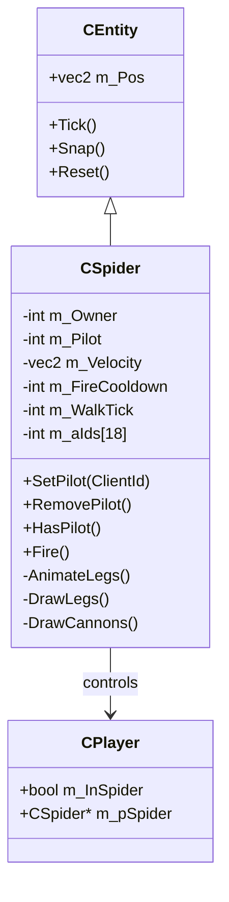

# Design Document: Spider Exoskeleton

## Overview

Spider - это механический экзоскелет паука для DDNet Server. Игрок управляет пауком с восемью анимированными ножками и двумя гранатомётами. Паук отрисовывается лазерными линиями и следует паттерну существующих транспортных средств (Tank, Helicopter).

## Architecture



## Components and Interfaces

### CSpider Entity

Основной класс паука, наследуется от CEntity.

```cpp
class CSpider : public CEntity
{
public:
    CSpider(CGameWorld *pGameWorld, vec2 Pos, int Owner);
    
    void Reset() override;
    void Tick() override;
    void Snap(int SnappingClient) override;
    
    int GetOwner() const;
    int GetPilot() const;
    void SetPilot(int ClientId);
    void RemovePilot();
    bool HasPilot() const;

private:
    void Fire();
    void CalculateLegPositions(vec2 *pLegs);
    
    int m_Owner;           // Создатель паука
    int m_Pilot;           // Текущий пилот (-1 если пусто)
    vec2 m_Velocity;       // Скорость движения
    int m_FireCooldown;    // Кулдаун стрельбы
    int m_WalkTick;        // Счётчик для анимации ног
    float m_CannonAngle;   // Угол наведения пушек
    
    int m_aIds[18];        // IDs для snap объектов (8 ног + 2 пушки + тело)
};
```

### Leg Animation System

Ноги анимируются по синусоиде с чередованием фаз:
- Ноги 0, 2, 4, 6 - одна фаза
- Ноги 1, 3, 5, 7 - противоположная фаза

```
    Leg Layout (top view):
    
       0   1
      /     \
     2       3
     |       |
     4       5
      \     /
       6   7
```

### Cannon System

Две пушки расположены по бокам тела паука:
- Левая пушка: смещение (-40, -10)
- Правая пушка: смещение (+40, -10)

Обе пушки стреляют одновременно в направлении курсора.

## Data Models

### Spider State

| Field | Type | Description |
|-------|------|-------------|
| m_Owner | int | ID игрока-создателя |
| m_Pilot | int | ID текущего пилота (-1 если пусто) |
| m_Pos | vec2 | Позиция центра паука |
| m_Velocity | vec2 | Текущая скорость |
| m_FireCooldown | int | Тики до следующего выстрела |
| m_WalkTick | int | Счётчик анимации ходьбы |
| m_CannonAngle | float | Угол наведения пушек |

### Leg Configuration

| Leg Index | Base Offset | Phase |
|-----------|-------------|-------|
| 0 | (-30, -15) | 0 |
| 1 | (+30, -15) | π |
| 2 | (-40, 0) | 0 |
| 3 | (+40, 0) | π |
| 4 | (-40, +15) | 0 |
| 5 | (+40, +15) | π |
| 6 | (-30, +25) | 0 |
| 7 | (+30, +25) | π |

## Correctness Properties

*A property is a characteristic or behavior that should hold true across all valid executions of a system-essentially, a formal statement about what the system should do. Properties serve as the bridge between human-readable specifications and machine-verifiable correctness guarantees.*

### Property 1: Spider creation assigns pilot
*For any* player executing the spider command, the created Spider entity SHALL have that player as the Pilot.
**Validates: Requirements 1.1, 1.2**

### Property 2: Leg count invariant
*For any* Spider entity, the rendering SHALL always produce exactly 8 leg laser lines with endpoints from body to ground level.
**Validates: Requirements 1.3, 5.1**

### Property 3: Cannon symmetry
*For any* Spider entity, the two cannons SHALL be positioned symmetrically on opposite sides of the body center.
**Validates: Requirements 1.4, 5.2**

### Property 4: Movement updates position
*For any* Spider with a Pilot, when input direction is non-zero, the Spider velocity SHALL change in that direction AND the Pilot position SHALL equal the Spider center.
**Validates: Requirements 2.1, 2.4**

### Property 5: Leg animation during movement
*For any* Spider with non-zero velocity, leg positions SHALL vary over time with alternating phases between odd and even indexed legs.
**Validates: Requirements 2.2, 5.3**

### Property 6: Dual cannon fire
*For any* fire action, exactly two Grenade_Projectiles SHALL be created, one from each cannon position.
**Validates: Requirements 3.1**

### Property 7: Fire cooldown enforcement
*For any* Spider, after firing, subsequent fire attempts within the cooldown period SHALL be rejected.
**Validates: Requirements 3.3**

### Property 8: Exit destroys spider
*For any* Spider with a Pilot, when the Pilot executes the spider command again, the Spider entity SHALL be destroyed AND the Pilot reference SHALL be cleared.
**Validates: Requirements 4.1, 4.2**

### Property 9: Disconnect cleanup
*For any* Spider, when the Pilot disconnects, the Spider entity SHALL be destroyed.
**Validates: Requirements 4.3**

## Error Handling

| Scenario | Handling |
|----------|----------|
| Command without character | Ignore command |
| Pilot disconnects | Destroy spider via RemovePilot() |
| Spider collides with wall | Stop velocity in that direction |
| Fire during cooldown | Ignore fire input |

## Testing Strategy

### Property-Based Testing Library
Используем существующую тестовую инфраструктуру DDNet (GTest) для unit-тестов. Property-based тесты будут реализованы через параметризованные тесты с генерацией случайных входных данных.

### Unit Tests
- Тест создания Spider entity
- Тест назначения/удаления пилота
- Тест обработки input для движения
- Тест механики стрельбы и cooldown

### Property-Based Tests
Каждое свойство из раздела Correctness Properties будет реализовано как отдельный property-based тест:
- Тесты должны запускаться минимум 100 итераций
- Каждый тест должен быть помечен комментарием: `**Feature: spider-exoskeleton, Property N: <property_text>**`

### Integration Tests
- Тест полного цикла: создание → управление → стрельба → выход
- Тест взаимодействия с коллизиями карты
